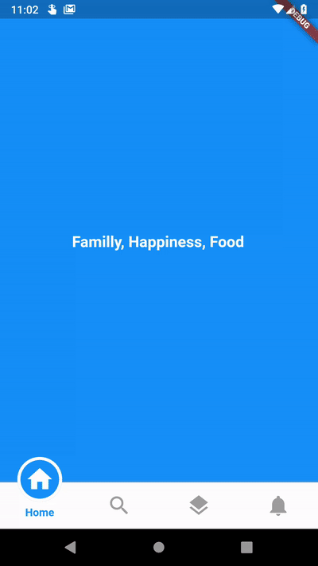

# Circular Bottom Navigation (or maybe a tab bar).

This is implementation of an artwork in [Uplabs](https://www.uplabs.com/posts/bottom-tab)



Go through this instruction to use this package in your flutter app

## 1 - Depend on it

### Add this to your package's pubspec.yaml file:

```
dependencies:
  circular_bottom_navigation: ^0.0.2
```

## 2 - Install it

### install packages from the command line:
```
flutter packages get
```

## 3 - Import it
### Now in your Dart code, you can use:
```
import 'package:circular_bottom_navigation/circular_bottom_navigation.dart';
import 'package:circular_bottom_navigation/tab_item.dart';
```

## 3 - Use it like a charm
### Make your TabItems
```
List<TabItem> tabItems = List.of([
    new TabItem(Icons.home, "Home", Colors.blue),
    new TabItem(Icons.search, "Search", Colors.orange),
    new TabItem(Icons.layers, "Reports", Colors.red),
    new TabItem(Icons.notifications, "Notifications", Colors.cyan),
  ]);
```

### Use it widget everywhere you want
```
CircularBottomNavigation(
      tabItems,
      selectedCallback: (int selectedPos) {
        print("clicked on $selectedPos");
      },
    )
```